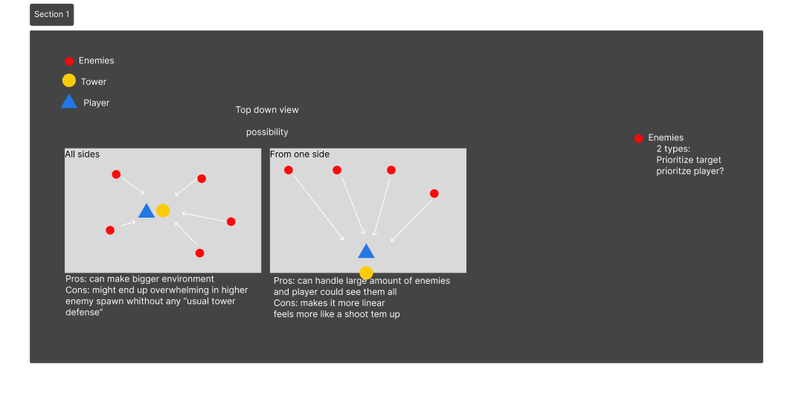

# Process Journal
**Reminders**

[this is a link](https://www.youtube.com/watch?v=dQw4w9WgXcQ)

**bold**

_italics_

[project for class today](//Projects/Journal.md)

## January 23rd - Make a thing

#### Thoughts about Twine and using Twine as an engine
- I want to take advantage of the fact that it is mostly 
imagination and written.
- trying to make the hyperlink not too clunky ? and try 
  and integrate it.
- maybe dive into a possible idea for a future project in 
  this class?

#### Ideas/concepts
1. A blind detective or someone that does not see well 
conventionally

2. A communication device with someone like lifeline 
   game 2015 type deal
   - journal of someone magical type ( feeling like a 
      conversation) (learning about that world)
   - Someone in trouble and only communication grounded in 
     real life ( basically a puzzle game but with additional steps and a proxy.)
   - log of a crew or something that is increased making you on the edge of your seat ( so just a book but instead a making it “electronic”)

#### playtest-ish feedback

- reading is long lmao 
- someone who finished it and knew about mythology 
- liked the idea of helping someone in communication 
- More hints of what the mural and story mean since it wasn’t too obvious 
- People used the back around immediately, maybe making a save to go back or take advantage of it. People would go back with that arrow instead of setting up something. 
- People doesn't stay on the death screen too long, so if there is a timed even,t don’t make it too long

## January 30rd
[This week's project](https://github.com/Noe235/CART315/tree/main/Projects/Week%202%20FaillingAsleep/FallingAsleep)  

Idea for a collector type of game. 
Ideas:
- A dodging type of game like subway surfers?
- A beginning of a rhythm game like prosekai
- A simple collection game nothing fancy
- A game where you grow bigger when you eat things

probably going to try and do the prosekai-ish. So restraining the player to a specific position. The position will be stored in an array probably like this:
myPos []= new position maybe vector 3?

then do the same for the dropper and change the frequency.
change the sprite for a guitar and notes
adding some sound and a little menu page just to start it.

Testing out the code tonight and if it doesn’t work going back ot the basic collecting game

_**REMINDER FOR NOE**_  
if you have a number with points, and you have this error  
``Cannot convert expression of type 'double' to type 'float'``  
you need to put “f” at the end of the number to tell it its a float still

### Process
Lots of random error that I am not even sure why it happened  
Errors like: 
- ``Null reference type``
- ``Cannot acess a non-static method``
- ``Play OneShot``

The rest was alright, I had forgotten how to access a array but got my 
friend to help me out. 
I found some nice assets on Craftpix to give a bit of personality to the 
little exercise. +the sound effects were not too hard to implement  
I kind of see this as a little game that each row does a sound and ten you 
can make some music or have it randomized and making some non-scripted music 
but still sounding good.  
I did use the pentatonic scale on C3 to get some notes that would not sound 
dissonant from one another. 

### Future implementations
Possible implementations that I would like or center around something
- Making random prefabs that would be chosen to fall down.
- attaching the note to the line that it is falling from.
- making or finding a minecart sprite
- adding bg music to have the notes have a bg
- adding start and end state

### Class
Feedback tips for future journal entry
- use EZGIF to add some gif and take photos of the process  
Which reminds me I should have put that as a byproduct of not being able to 
  use playoneshot, I used playatthispoint and got a slight pan on the sound 

Prototypes kind
- look/feel
  - non functional really just to show
- roles
  - user flow, kickstarter videos
- implementation
  - really trying how it feel while being functional.  

Prototype goals

- to understand
- to communicate
- 

**all to answer a question**

## Feb 4th-6th
[This week's project Pong](https://github.com/Noe235/CART315/tree/main/Projects/Week%203%20Pong/pawngTemplate)    

### ideation
I was thinking about games like it takes two and chained together as a pon 
variant where you would work together. So with this in mind I was looking of 
how to make a rope that would constraint the players as I can think how I 
can constraint the player with most likely some math to calculate the 
distance and put a maximum to to but I wasn't sure how to illustrated it. So 
I found this video and I am using the rope bridge part but without the 
capsule collider so I can show visually if they are too far.  

Video used:

[Rope video/physics?](https://www.youtube.com/watch?v=iGlD3f-5JpA)

[checking distance between points](https://www.youtube.com/watch?v=VpK2NgmddkQ)

### Problems/ what left to do
- I can't figure out how I am going to attach the rope to the object
- I don't know how one I have reached the max distance i'll make the person 
  be able to not go further but still to move toward the other player
- Link the score to a text
- maybe add color or sound?
- maybe add end screen and restart
- add high score?

I discovered the magic of joints and hinge though. They seem really useful 
to know about just not fully sure I understand how to make them work with an 
object that is not static.

Alright change of plan we are making a who can hit hte ball the most and 
separating the screen in two. I changed idea since I couldn't do the chain 
and I didn't want to go back to the same original game.

I want to add some ball to appear over time but for now everything works so 
I'll add it after commit

tiny problem the score are on the balls, but its fixed I got the middle wall 
to have the scoring script that access the variable of each ball to then put 
the scores together, there is definitely a better way to do this but since I 
don't have much time nad we kind of already know we fucked up by putting 
everything on the ball we knew that its wasn't that efficient.

### possible improvements 
- add a game over screen maybe with lives
- OMG THE SPEED OF THE PADDLE CHANGES WITH SCREEN SIZE, probably do something 
  about that
- add that more ball will spawn over time, could have been possible but 
  would need to rearrange some components and make new scripts.
- sometime the ball gets stuck horizontally

### Class

push error: 
- 1 if the original files are different and were not pulled
- push fail because of too big file: bottom right git icon, you can undo it 
- third party is for asset store and things oyu don't want to share

bit trip beat

## Feburay 11th
[Breakout project](https://github.com/Noe235/CART315/tree/main/Projects/Week%204%20Breakout/breakinOut)

### ideation
I have no clue for this week.... ngl I don't really fell like starting to 
code different bricks that still not be used again so I am thinking....  
I guess maybe like the other way around where you would play as the brick 
and you want to dodge the ball that are coming at you. I could make the 
space moving in 2d than just one axis. 
... maybe I can put that there is two paddles that are playing adn oyu have 
to dodge it. I wonder if I can make the paddle move by itself to try and get 
the ball... maybe through a update that tracks the ball and move the paddle 
toward the x direction that the ball is like if get hte position of the ball 
and go toward it with a random number and make it move every either random 
or set number.

### feb 12th

I added the UI added a menu screen and hooked them all up with the game, 
menu and the game over.

I am debating between just doing the break out game as it is or try to 
modify it into a different kind of game.

So I lied, I didn't work more on it, so here's the result for this week
I also added random colors to bricks

### Feburary 19th-20th

[Procedural excersise](https://github.com/Noe235/CART315/tree/main/Projects/Week%205%20Procedural/Procedural%20Generation)
I don't really have any idea for expanding on the breakout game from last 
week. Instead I will just make a new project and follow a ytb tutorial about 
a topic that will help me in game. I was thinking either some procedural 
generation or AI enemy behavior. I think both of are useful to know how to 
code or understand how they work.

I have coded a procedural generation before but it didn't really work well 
so I would like to give it a shot once again, espically since I like 
rogue-like and replayability in games

I decided on this tutorial series [Procedural generation](https://www.youtube.com/playlist?list=PLcRSafycjWFenI87z7uZHFv6cUG2Tzu9v)

### Feburary 20th
I made a generation with corridors as the turorial continues. Now the 
corridors are generated and the rooms are added. I started 
doing a generation based on splitting the zone into rooms to generate rooms 
and them.

I think I learned quite a lot form the tutorial, I used argurment I have 
never used before such a HashSet, reference to object like xyz.Add or 
UnionWith. I laos think I better understand getting function and variables 
form different script and how to use return more. I briefly touched on the 
tilemap but I know at least it exist and how to acces them. And finally I 
understood how the generation is created and what it is checking for or how 
it goes along a path.

## Febuary 28th

#### possible project idea

I was brainstorming about something I would like to have or could find fun to do.
I was singing in my car, and I thought about how I didn't know all the lyrics to my song.
So, I could make an app that can be customized and help remember song lyrics.
Learning how to make a game on mobile wouldn't be too bad.
I also think these types of games can be nice time killers while they could be useful too,
cause that's one of the grips I sometimes have with mobile games.
Anyway, I was thinking of making it customizable/actually a little dumb where it would just take the words you have given it without even knowing what they are and instead randomize them, which have to be refilled.
The app would have different learning stages, so drag and drop the word from the first stage to the last,
where you would have to rewrite it. I was thinking of drag and drop, something similar to Duolingo,
where it shuffles words, and you sometimes have to put it back in the right order.
I'm not sure if it would count as a game, but maybe I could modify it to change some level to gamify it more
I have lyrics in mind for it right now but I can see it being done with like 
whatever the person might want learn it as. it's a bit different than clue 
cards but it can be used that way. There is also the issue that some people 
rememebr beats to help them memorize the song and that would be mayba bti 
more complicated for copyright and all. not even counting how do you cute 
the part of the song at the right time but yeah that is something to also 
consider. 

Block: fill the empty space with the correct words from a bank  
sentence: you have to write some full sentence from the word bank 
scramble: the lines are scrambles you have to arrange them 
paragraph: the paragraph like verse and chorus are scramble and you have to 
arrange them 
type all: you have to type all the lyrics 

I am thinking of teaming up with some people to make the game but I am not 
quite sure yet, but I might team up with kat. A roguelike would be kinda 
cool. I think I'll ask the class how we might fell about this prototype 
otherwise I'll probably join someone. I want to do a game but I don't want 
to make a game that requires wayy too many systems. The project timeline is 
only 4 weeks, or getting a protype. But the learning game-ish app right now 
doens't feel like it is very good game project to demonstrate skills. or 
game making.

### March 13th 
teamed up wth Acacia we a doing a sort of tower defense game but not along a 
specified path so I would say kinda like left 4 dead and Original Fortnite.

Alright here are the link dumps:

[Shared Github Repo](https://github.com/Noe235/CART315FinalProject)

[Google Doc](https://docs.google.com/document/d/1r3TfF7R476a0rbi3PBWWZrRVH3jYj5AJKdqc2FuSl5Q/edit?usp=sharing)

So we are still testing out what the core gameplay will be like and all but 
I coded some mechanics such as shooting. I followed [this tutorial](https://www.youtube.com/watch?v=T5y7L1siFSY) The blueprint seems pretty 
easy to modifying and implement as we want.

Otherwise beforeward, I was thinking of how the game would look like as a 3D 
enviroment compared to the usual along specified path and 2D.

## March 15-20th
Weekly Link reminders:
[Shared Github Repo](https://github.com/Noe235/CART315FinalProject)

[Google Doc](https://docs.google.com/document/d/1r3TfF7R476a0rbi3PBWWZrRVH3jYj5AJKdqc2FuSl5Q/edit?usp=sharing)

Thinking a bit more about the upgradable spell and thinking that the fire 
upgraded to a flamethrower.

[Flame thrower tutorial one](https://www.youtube.com/watch?v=Qu9qIpyoVK8)  
[Flame thower turorial two](https://www.youtube.com/watch?v=IY2K2cOE0R8)

Otherwise change the AI pathing to a state machine and some navmesh with 
htese turorials

[Navmesh turorial](https://www.youtube.com/watch?v=mJu-zdZ9dyE)  
[State Machine turorial](https://www.youtube.com/watch?v=db0KWYaWfeM)

Looking into dabbling a bit with the inventory as well  
[Recipes objects](https://www.youtube.com/watch?v=E91NYvDqsy8)  
[Drag and drop inventory](https://www.youtube.com/watch?v=kWRyZ3hb1Vc)

Possible Mock up I was thinking 

### March 19th

Alright so this week's goals:
- Add Inventory
  - make UI
  - find or make physical asset
  - add crafting window
- Add Permanent UI
- add upgrade to spells

I work on all of them
#### Inventory
For the inventory I have started the basic one where you would open a window 
and click on things. Additionally I also have a mockup of what it could feel 
or look like. This is more a look and feel and the one in unity an 
implementation.

For asset for the UI I have compiled a list of possible free Asset to choose 
fomr the Unity store. We just have to decide as a team which kind of 
stylized we want  
[Folder of Assets for Unity Store](https://assetstore.unity.com/lists/cart-315-final-project-possible-3574314563200)

#### Pathfinding
So I changed the simple follow to a state machine and changed the 
pathfinding to use NavMesh instead. This make it so if we decided to add 
building and so on, the AI will know that it cannot step on it. So the enemy 
follow until a certain distance then they go back for the core.

#### Damage and spell
I finished the enemy health and added that the spell does damage. I can 
change th value from the variable. I am working on a flamethrower for the 
final upgrade to the Fire spell.

#### The next steps
- finishing the crafting
- Add levels to spell
- Add the pickable
- making menu UI
- Implementing all the code together
- implement the assets? (optional)
- 
